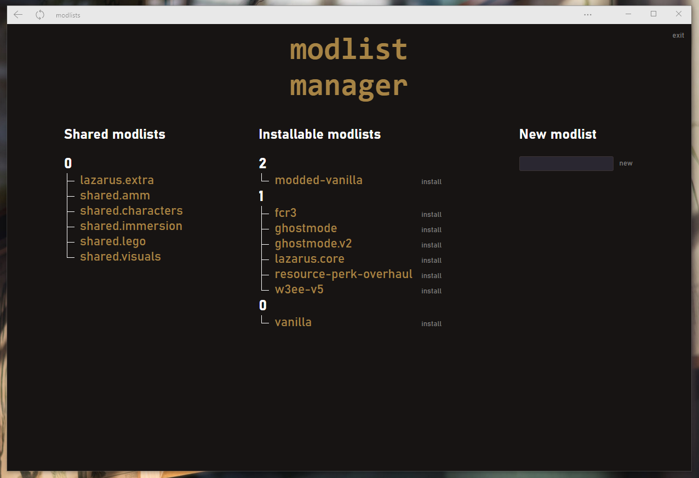
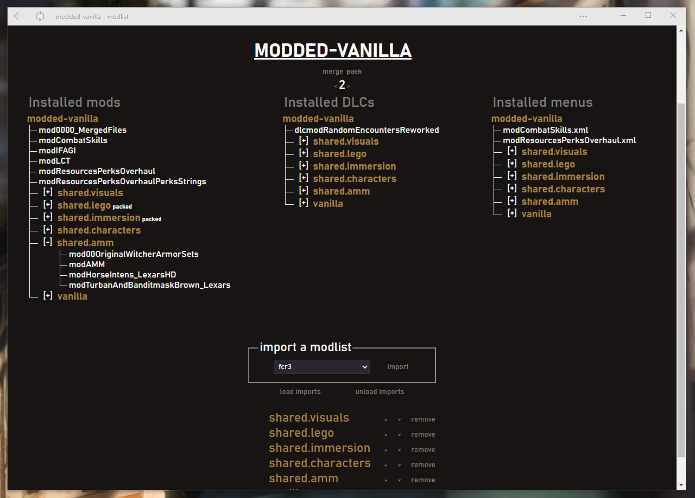
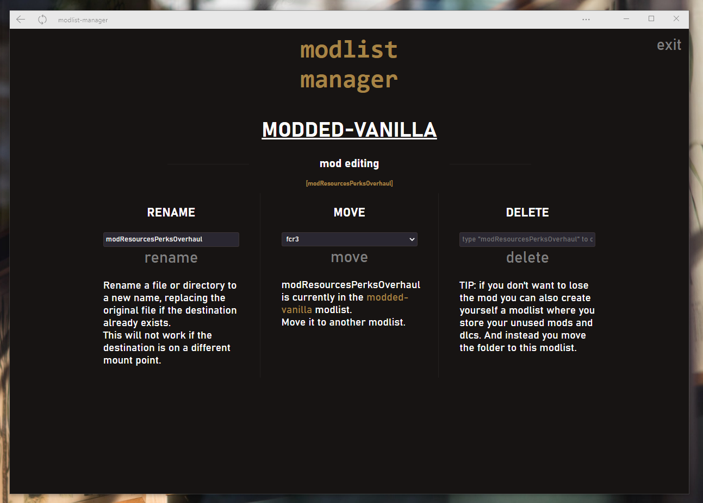
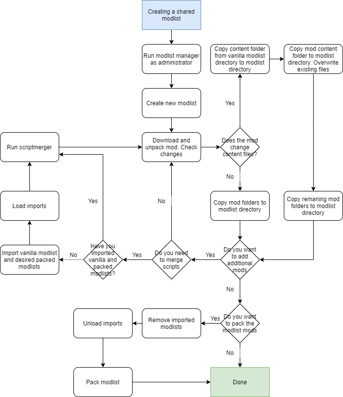
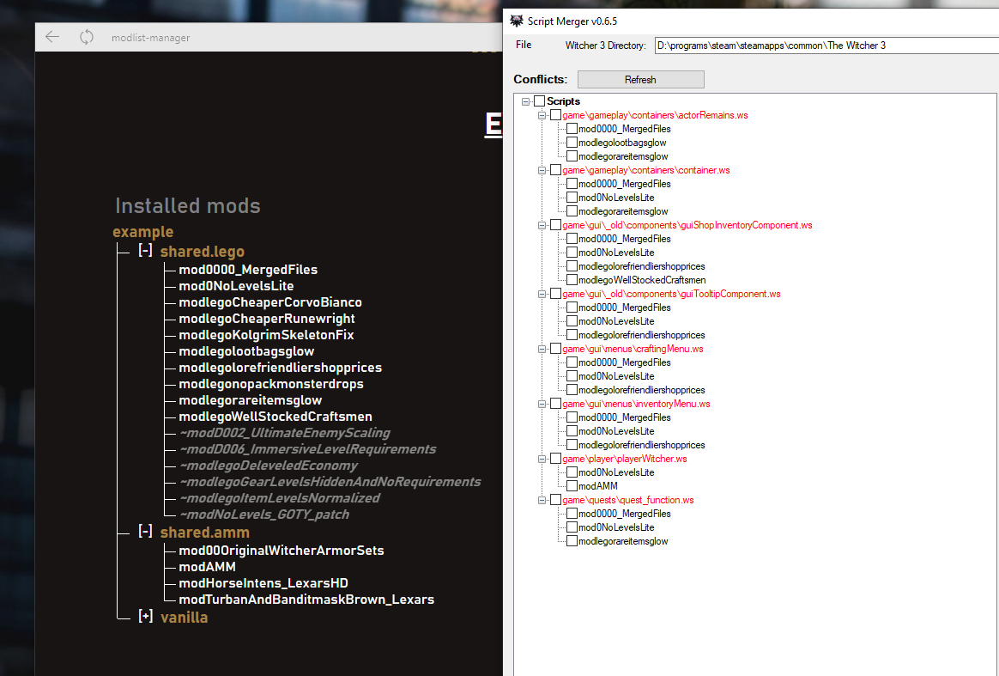
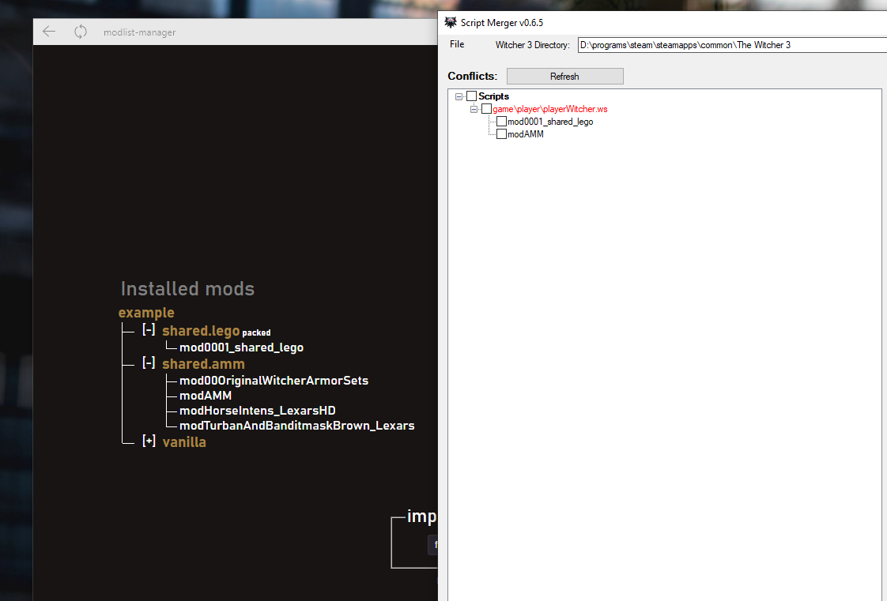

# witcher-3-modlist-manager
Small utility to manage different mod lists for the game The Witcher 3 

# Images
**[Youtube link](https://www.youtube.com/watch?v=s4hkZXRD_Vw)**
___

_home page_
___

_a modlist_
___

_editing a mod_
# Installing

- download the binary from the [releases](https://github.com/Aelto/tw3-modlist-manager/releases)
- create a directory in your witcher install `The Witcher 3` called `modlists`, so that you have `The Witcher 3/modlists`

# Using it
**IMPORTANT:** The tool has to run with administrator privileges to function correctly. This is because Windows prevents simple programs from creating symlinks, which is what this tool uses to be so efficient and fast. You can do so on Windows by right clicking the executable and click "Run as Administrator". _Please be aware that running a program as administrator is usually a bad idea as it gives full access to your computer. In this case the tool is open source, which means you can see its [source code](https://github.com/Aelto/tw3-modlist-manager/tree/main/src) and confirm it doesn't do more than it should. But i thought i'd still talk about that point just so you're aware!_

On first launch the option to `initialize` is available. This option moves the necessary vanilla files into a modlist called `vanilla`, so the files will be moved into `The Witcher 3/modlists/vanilla` (in case you want to revert it). Of course, if your current install was a modded game, your vanilla modlist won't be exactly vanilla but your current install.

> I would advise to create yourself a real vanilla install. You will have trouble swapping between modlists because your vanilla modlist won't be a real vanilla install and som DLCs or content scripts will be modified.
>
> you will see later, but the vanilla modlist is important as it's a requirement for all other modlists. It contains the base game DLCs and scripts

Here is a diagram of the full workflow, it shows how you can create modlists, import them and even pack them. (courtesy of Dr Nick)

## Creating a modlist
Once the you've initialized the modlist manager, you can now create a new modlist with the text input and the `new` button. A modlist is just a directory with 6 folders, if any of these six folders is missing the manager won't consider the modlist as valid and won't display it in the interface.

- the `mods` is where you drop all mods, the same way you did in vanilla
- the `dlcs` directory is where you drop all DLCs, the same way you did in vanilla
- the `menus` directory is where you drop the `.xml` files used to create mod menu. It's a bit different than you usually do, in vanilla you used to drop a folder called bin in your game install and it added the menu files in your game. This time, you have to go in the `bin/config/r4game/user_config_matrix/pc` and find any `.xml` file you can find and drop them in the `menus` directory of your modlist.
- the `saves` directory is where you settings and saves are stored, not a very fitting name i agree and i'll probably change it later, but at the moment it's an exact copy of what you have in `Documents/The Witcher 3`
- the `content` directory is where you drop changes to the `content0/scripts`. But mods who change content0 are a tiny bit different from the other folders like mods or dlcs as the archive you get from them often include only the files they changed and not the whole content scripts. And because the modlist manager doesn't go deeper than one directory (it's intended) so if you just drop the changed content0 scripts your game won't launch because it will say missing X ou Y. So if you install modlist it's advised to first pick the content from the vanilla modlist and only then drop the changed content0 scripts and replace all.
- the `bundles` directory is for changes made to `content0/bundles`. Very few mods touch these files, the only one i know is Besserwisser's fixes and in this case just drop the modified bundles in the directory. No need to do the same procedure as the `content0/scripts` directory this time.

## Importing a modlist
You've created yourself a new modlist, but that's not enough. Imagine you added a new mod in your modlist and wanted to install it. The game won't launch because it's missing all the necessary vanilla files such as the content directory, and the sixteen or so base DLCs.

For this reason modlist imports were created. Your modlist can import the vanilla modlist to inherit all of its content, the vanilla files. **this is why you must ALWAYS import the vanilla modlist**.

modlist imports occur from top to bottom. And if an imported modlist tries to import a file that already exists in your current modlist, it will ignore it and won't import anything. So you can edit the load order of the imported modlists with the little up/down arrows. **the vanilla modlist should always be last import to avoid erasing your modified files by priority**.

After your changes to the import list, you can choose to unload or load all imports. When you load imports it creates a series of symlinks linking to the files from the different modlists you imported. Be careful, as these files are not copies but instead shortcuts to the real files in the other modlists. If you edit them, the original files will be edited too and it may break the imported modlist.

So before doing any changes to your modlist, i would advise to unload the imports. And to load the import only when you're sure you won't touch anything sensitive mod file.

## Installing a modlist
Ok so now you have a new modlist and its imports are all set up. You can install it by going to the home page (by clicking the modlist manager title) and you can click the `install` button right next to its name and the modlist will be installed. The process is almost instant so you may not see it, but it was installed. 

You can now launch the game and confirm the modlist you just installed is valid.

## Merging a modlist
You're maybe wondering how it will work with your merged files. The modlist manager supports mergeinventory swapping too. The mergeinventory is what scriptmerger uses to store which mod you merged and which one you installed.

If you place a `MergeInventory.xml` file in the root of your modlist (example: `The Witcher 3/modlists/ghostmode/MergeInventory.xml`) when you will install the modlist, if you have scriptmerger installed in the directory `The Witcher 3/scriptmerger` and there is no mergeinventory in the scriptmerger install directory, the modlist manager will swap the mergeinventory to the one used by your modlist.

So imagine i want to merge all my mods used by the `ghostmode` modlist, which imports the two modlists `vanilla` and `random-encounters-reworked`:
- I go load all imports to inherit from the vanila and RER files
- Then i install the modlist, which places the mergeinventory in the scriptmerger install and also swap the `The Witcher 3/mods` directory (used by scriptmerger)
- I confirm i didn't inherit from the mergedfiles from another modlist i imported by going in `The Witcher 3/mods`, and if i did, i delete the directory (no risk here, you're just deleting the shortcut and not the actual merge).
- I open script merger and proceed with the merge.

## Packing a modlist
You may have noticed the modlist manager offers the option to pack modlists. This feature tells the modlist manager to transform
every mods in the modlist (even those imported) so that the script-merger sees the entire modlist as a single and unique mod.

Here is an example, i created an example modlist that imports two other modlists:
- `shared.lego` with a bunch of lego mods
- `shared.amm` with the Appearance Menu Mod and a few textures.

Here is what the script merger sees if i leave the `shared.lego` modlist unpacked:

And now after clicking the `pack` button in the `shared.lego` modlist, here is what the script merger sees:

It allowed me to merge the `shared.lego` alone so that i won't have to re-merge the mods every time i import the modlist. Now the script merger sees it as a single mod named `mod001_shared_lego` and shows only the new conflicts between the modlists.

If you want to revert the packing process, there is the `unpack` button. It is useful in cases where you want to add a mod to a packed modlist. In such cases:
- unpack the modlist
- add the new mod
- merge the scripts and resolve the conflicts if there are any
- pack again